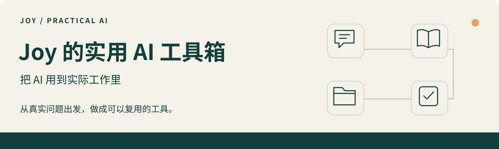

# Joy｜把 AI 用到实际工作里

来自业务一线，分享经过反复打磨的 **Skills、工作流与小应用**。关注具体问题，也关心普通用户能否顺利完成第一次使用。

[**从这里开始 →**](https://github.com/JoyZhang666/joy-agent-skills/blob/main/docs/start-here.md) · [浏览全部作品](https://github.com/JoyZhang666/joy-agent-skills) · [查看使用指南](https://github.com/JoyZhang666/joy-agent-skills/blob/main/docs/start-here.md)

### 三件作品，三个具体问题

**[Get 会议行动](https://github.com/JoyZhang666/joy-agent-skills/blob/main/getnote-meeting-actions/README.md)**  
会议结束后，下一步做什么？从会议原文整理有依据的行动清单，按编号推进、续接。

**[Youtube 转写全文稿](https://github.com/JoyZhang666/joy-agent-skills/blob/main/youtube-transcript/README.md)**  
想把视频交给自己或 Agent 细读？输入视频链接，保存为本地 Markdown 全文稿草稿，再对照核验。

**[全书精读工作流](https://github.com/JoyZhang666/joy-agent-skills/blob/main/full-book-deep-reading-workflow/README.md)**  
想认真读完一本书？按章节留下原文定位、笔记和进度，下次从记录继续。

### 按你想做的事，找一个工具

- **会议与执行** · [Get 会议行动](https://github.com/JoyZhang666/joy-agent-skills/blob/main/getnote-meeting-actions/README.md)
- **知识与阅读** · [视频全文稿](https://github.com/JoyZhang666/joy-agent-skills/blob/main/youtube-transcript/README.md) / [全书精读](https://github.com/JoyZhang666/joy-agent-skills/blob/main/full-book-deep-reading-workflow/README.md) / [GetNote 知识库整理](https://github.com/JoyZhang666/joy-agent-skills/blob/main/getnote-knowledge-manager/README.md)
- **日常管理** · [项目文件管理](https://github.com/JoyZhang666/joy-agent-skills/blob/main/project-file-management/README.md) / [课程课时台账](https://github.com/JoyZhang666/joy-agent-skills/blob/main/class-hours-ledger/README.md)
- **技术工具 · 进阶** · [mihomo 安装与运维](https://github.com/JoyZhang666/joy-agent-skills/blob/main/mihomo-vpn-install/README.md) / [Crossborder Tunnel Kit（实验性）](https://github.com/JoyZhang666/joy-agent-skills/blob/main/crossborder-tunnel-kit/README.md)

### 实践手记

把调教工具的判断过程也留下来。

- [返回了文字，为什么还不能算“全文交付”？](https://github.com/JoyZhang666/joy-agent-skills/blob/main/docs/notes/transcript-completeness.md)
- [一个 Skill 公开前，如何检查隐私与来源？](https://github.com/JoyZhang666/joy-agent-skills/blob/main/docs/notes/publish-with-care.md)
- [怎样让第一次配置 API 的人走完最后一步？](https://github.com/JoyZhang666/joy-agent-skills/blob/main/docs/notes/first-api.md)

### 值得关注的改进

- **Youtube 转写全文稿 · v2.2.1**：补全输入、Markdown 交付与新手 API 配置指南。
- **GetNote 知识库整理 · v2.0.0**：分类建议、有效授权与逐条归档核验。
- **项目文件管理 · v1.1.2**：提供工作区索引、交接模板与本地检查工具。

这些是当前版本的能力摘要；实测范围与限制请查看各项目说明。欢迎用[脱敏示例反馈问题](https://github.com/JoyZhang666/joy-agent-skills/issues)，一起把工具磨得更好用。
